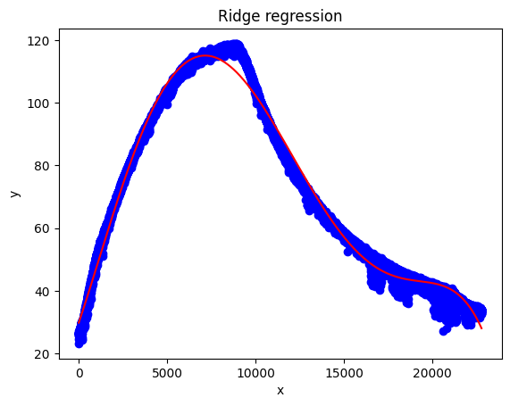

# Polynomial Regression with Ridge regularization

## Overview
This repository contains an implementation of **Polynomial Regression with Ridge regularization**, a regularized regression technique that helps mitigate overfitting in polynomial models. The core algorithm is implemented using **NumPy**, but also there is and implementation using libraries like scikit-learn. Additionally, Jupyter notebooks are included to demonstrate the performance of the custom functions on different datasets, including datasets from **Kaggle**.

## Features
- **Handcrafted Polynomial Ridge Regression**: Implemented from scratch using NumPy.
- **Customizable Regularization**: Adjust the Ridge penalty (L2 regularization) to see its impact on polynomial fitting.
- **Jupyter Notebook Demonstrations**: Interactive examples applying the algorithm to various datasets.
- **Dataset Handling**: Includes experiments with real-world data from Kaggle.



## Repository Structure
```
📂 ridge-regression
│── 📜 README.md                # This file
│── 📂 src                      # Python module with the main implementation
│   ├── polynomial_ridge.py     # Core implementation of polynomial ridge regression
│── 📂 notebooks                # Jupyter notebooks with case studies
│   ├── polynomial_ridge_demo.ipynb   # Demonstration of the algorithm
│   ├── kaggle_dataset_experiment.ipynb # Application to Kaggle dataset
│── 📂 datasets                 # Folder for datasets
│── 📜 requirements.txt         # Dependencies
```

## Installation
Ensure you have Python installed, then clone the repository and install dependencies:
```sh
git clone https://github.com/yourusername/polynomial-ridge-regression.git
cd polynomial-ridge-regression
pip install -r requirements.txt  # If dependencies are needed
```

## Usage
### Running the Python Module
The core algorithm is implemented in `src/polynomial_ridge.py`. Here’s an example of how to use it:
```python
import numpy as np
from src.polynomial_ridge import PolynomialRidge

# Sample dataset
data_x = np.array([1, 2, 3, 4, 5])
data_y = np.array([2.2, 2.8, 3.6, 4.5, 5.1])

# Instantiate and fit the model
ridge_model = PolynomialRidge(degree=3, lambda_=0.1)
ridge_model.fit(data_x, data_y)
predictions = ridge_model.predict(data_x)
```

### Running the Jupyter Notebooks
To explore the notebooks, launch Jupyter Notebook in the `notebooks/` directory:
```sh
jupyter notebook
```

Open and run the `polynomial_ridge_demo.ipynb` or `kaggle_dataset_experiment.ipynb` notebooks to see the model in action.

## Contributions
If you’d like to improve this project, feel free to submit a **pull request** or open an **issue**!

## License
This project is licensed under the **MIT License**. See the `LICENSE` file for details.

## Contact
For any inquiries, reach out via GitHub Issues or email: **your.email@example.com**.

